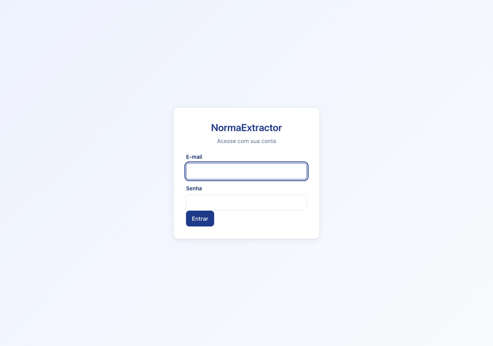
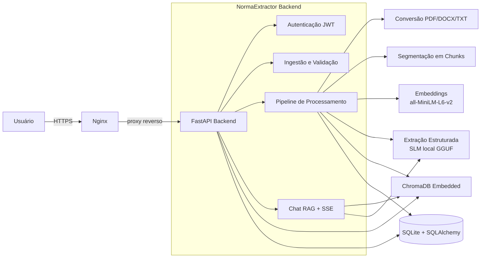

# NormaExtractor

NormaExtractor é uma aplicação full stack para ingestão de documentos normativos (PDF, DOCX e TXT), extração estruturada de cláusulas por meio de um modelo de linguagem local, indexação semântica e consulta interativa via RAG com streaming.

O sistema foi projetado para operar em uma VPS com recursos limitados (CPU, sem GPU) e sem dependência de APIs de terceiros para inferência.

[](LICENSE)
[](https://www.python.org/)
[](https://fastapi.tiangolo.com/)
[](https://react.dev/)
[](https://github.com/Radsfer/normaextractor/actions)

## Demo

Abaixo, uma demonstracao do fluxo completo: login, upload de uma norma em PDF,
acompanhamento do processamento, visualizacao das extracoes estruturadas e
consulta via chat RAG com citacao das fontes.



Acesse a aplicacao online em: https://normaextractor.adolfo.tec.br

> O acesso a demo e por convite. Para receber credenciais de teste, envie um
> email para rafael@adolfo.tec.br.

## Visão geral

O pipeline de processamento executa as seguintes etapas:

1. Validação do arquivo (formato, MIME e tamanho).
2. Conversão para texto plano Unicode.
3. Segmentação em chunks com limite de tokens e sobreposição.
4. Geração de embeddings semânticos.
5. Persistência no banco vetorial.
6. Extração estruturada de cláusulas via SLM local.
7. Validação e persistência relacional.
8. Disponibilização para consulta interativa via chat (RAG).

## Arquitetura



## Tecnologias

| Camada | Tecnologias |
|--------|-------------|
| Backend | Python 3.10+, FastAPI, Uvicorn, SQLAlchemy 2, Alembic |
| Inferência | llama-cpp-python (GGUF Q4_K_M, CPU) |
| Embeddings | sentence-transformers, all-MiniLM-L6-v2 |
| Banco vetorial | ChromaDB embedded (distância cosseno) |
| Banco relacional | SQLite (WAL) |
| Autenticação | JWT (HS256, 24h), bcrypt (custo 12) |
| Frontend | React 18, TypeScript, Vite |
| Streaming | Server-Sent Events |
| Infraestrutura | Docker, docker-compose, nginx, GitHub Actions |

## Funcionalidades

- Upload e processamento assíncrono de PDF, DOCX e TXT (1 KB a 20 MB).
- Conversão para texto, segmentação em chunks e geração de embeddings.
- Extração estruturada de cláusulas: tipo, sujeito, ação, prazo, base legal e penalidade.
- Consulta interativa via chat RAG com resposta em streaming e citação de fontes.
- Dashboard com métricas de cobertura, consistência e latência média.
- Autenticação JWT com senhas armazenadas como hash bcrypt.

## Requisitos

A especificação completa está em `docs/`, incluindo o SRS (`SRS_NormaExtractor_v1.0.md`) e as fichas de requisitos (`REQ-FUNC-*`, `REQ-PERF-*`, `REQ-SEC-*`).

## Estrutura do projeto

```
backend/     API FastAPI, pipeline de processamento, RAG e autenticação
frontend/    SPA React com login, upload, dashboard e chat
nginx/       Configuração do domínio para o nginx central da VPS
scripts/     Download do modelo GGUF e script de deploy
docs/        SRS e fichas de requisitos
```

## Como executar localmente

Pré-requisitos: Python 3.10+, Node.js 20+ e aproximadamente 2 GB de RAM livres para o modelo.

```bash
# 1. Baixar o modelo GGUF (uma única vez, cerca de 1,9 GB)
./scripts/download_model.sh

# 2. Backend
cd backend
python -m venv .venv && source .venv/bin/activate
pip install -r requirements.txt
cp .env.example .env
# Ajuste JWT_SECRET, ADMIN_EMAIL, ADMIN_PASSWORD e MODEL_PATH no .env
alembic upgrade head
uvicorn app.main:app --reload --port 8000

# 3. Frontend (em outro terminal)
cd frontend
npm install
npm run dev
```

O frontend em desenvolvimento fica em `http://localhost:5173`, com proxy para a API em `http://localhost:8000`.

## Testes

```bash
cd backend
python -m pytest tests/
```

Os testes do backend usam injeção de dependência para substituir o modelo de linguagem, o embedder e o banco vetorial, evitando a necessidade de carregar o modelo GGUF ou baixar o modelo de embeddings durante a execução.

## API

| Rota | Autenticação | Descrição |
|------|--------------|-----------|
| `POST /api/v1/auth/login` | Não | Login com email e senha, retorna JWT com expiração de 24h |
| `GET /api/v1/health` | Não | Healthcheck com status do modelo e uso de memória |
| `POST /api/v1/documents/upload` | Sim | Upload de PDF, DOCX ou TXT (1 KB a 20 MB) |
| `GET /api/v1/documents` | Sim | Lista documentos com filtros |
| `GET /api/v1/documents/{id}` | Sim | Detalhes de um documento |
| `DELETE /api/v1/documents/{id}` | Sim | Exclui documento e dados associados |
| `GET /api/v1/documents/{id}/extractions` | Sim | Extrações estruturadas de um documento |
| `POST /api/v1/chat` | Sim | Consulta RAG com streaming SSE |
| `GET /api/v1/metrics` | Sim | Métricas de cobertura, consistência e latência |

A documentação interativa (OpenAPI) fica em `/docs`.

## CI/CD

O workflow de CI/CD executa em todo push para a branch `main`:

1. Testes do backend com `pytest`.
2. Build e verificação de tipos do frontend.
3. Deploy via SSH para a VPS.

Os segredos `SSH_HOST`, `SSH_USER` e `SSH_PRIVATE_KEY` devem ser configurados no repositório para o deploy.

## Deploy

O deploy é automatizado pelo GitHub Actions. Para deploy manual na VPS:

```bash
ssh usuario@servidor
cd /caminho/para/o/projeto
docker compose build && docker compose up -d
```

O certificado TLS é emitido com Certbot e o domínio é servido pelo nginx central da VPS.

## Licença

Este projeto está licenciado sob a [MIT License](LICENSE).
